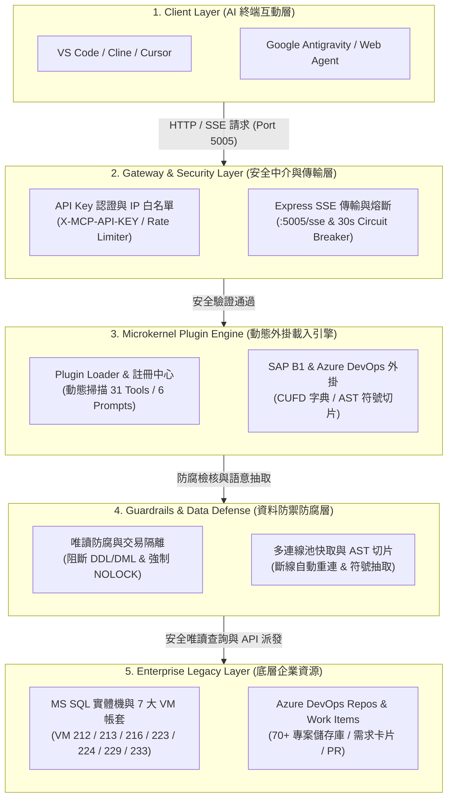

# Enterprise AI Gateway for SAP Business One & DevOps: TOGAF Architecture & Governance Specification

## 1. 系統架構概觀 (System Architecture Overview)

企業在長期運作 SAP Business One (B1) 與週邊客製化系統時，普遍面臨「原始碼與線上 DB 結構脫節」、「缺乏規格文件」、「商業邏輯缺乏追溯性」以及「跨系統排查成本高昂」等技術挑戰。

本系統基於 **Model Context Protocol (MCP)** 規範建構 **企業級 AI 網關中台 (Enterprise AI Gateway)**。透過 **微內核動態外掛架構 (Microkernel Plugin Architecture)**、**零信任唯讀隔離防腐層 (Zero-Trust ACL Guardrails)**、**長駐 SSE/HTTP 遠端傳輸** 與 **AST 語意符號抽取引擎**，將關聯式資料庫 (MS SQL Server 2012~2022) 與 Azure DevOps 需求/版控系統抽象為統一的 AI 驅動服務。

---

## 2. TOGAF 分層架構模型 (Layered Architecture)



---

## 3. SSDLC 安全治理與防護矩陣 (Security & Governance Matrix)

系統全面落實 **SSDLC 安全軟體開發生命週期**、**OWASP Top 10 (2025)**、**OWASP API Security (2023)** 與行政院 **資通系統防護基準**：

| 安全構面 (SSDLC / OWASP) | 實作機制 | 效益說明 |
| :--- | :--- | :--- |
| **A01/A02 存取控制與防爆** | 時序安全 `X-MCP-API-KEY` + Client IP 白名單 + 滑動窗口 Rate Limiter | 封鎖內網未授權來源，防禦時序攻擊、高頻 DoS 洪水與惡意撞庫。 |
| **A05 注入攻擊與深度防禦** | 唯讀防腐層 (`validateReadOnlySql`) + 識別字元白名單 (`validateIdentifier`) | 阻斷 DDL/DML、註解繞過、分號多語句與特殊字元注入，強制參數化綁定。 |
| **A04/A03 機密性與個資保護** | 自動遮罩機制 (`maskSensitiveData`) + 設定檔隔離 | 自動遮蔽密碼、PAT、信用卡與身分證號；連線資訊隔離不進 Git 版控。 |
| **A09 審計軌跡與可歸責性** | 每日滾動審計日誌 (`logs/audit-YYYY-MM-DD.log`) 留存 180 天 | 完整記錄人事時地物、耗時與受影響列數，具備自動輪轉與過期清理。 |
| **A10 錯誤收斂與安全故障** | 異常收斂與錯誤遮罩 (Fail Secure) | 對外不洩漏資料庫連線字串與內網主機路徑，詳細 Trace 僅留存內部 Audit。 |
| **交易隔離與防鎖死** | 強制注入 `WITH (NOLOCK)` | 讀取即時帳套時物理性隔絕讀寫鎖，確保不衝擊產線線上開單作業。 |
| **Token 與記憶體保護** | AST 語意符號抽取 (`get_symbol_content`) | 針對巨型 C# 或 SQL 僅抽取指定方法與註解，節省 90% Context Token。 |

---

## 4. 跨系統欄位比對與規格對齊 SOP (Schema Alignment Protocol)

針對程式碼、資料庫與業務規格對齊情境，定義自動化比對與驗證流程：

```
[Legacy C# Code]  -----+
                       |---> [audit_csharp_to_db_mapping] ---> [三方差異矩陣 Mapping Matrix] ---> [技術對齊公文草稿]
[DB CUFD / Schema] ----+                                                                      |
                                                                                              v
                                                                                 (抄送 PM、顧問與技術主管)
```

### 差異矩陣範例：
| C# 程式碼屬性/欄位 | DB 實際欄位/UDF | 型別/長度一致性 | 業務分歧與待確認點 (A 方案 vs. B 方案) | 建議確認項目 |
| :--- | :--- | :--- | :--- | :--- |
| `Department` | `U_Department` (NVarChar 10) | 一致 | A: 抓取部門代碼 / B: 抓取部門名稱 | 確認傳遞代碼或名稱規格 |
| `ReceiveType` | `U_ReceiveType` (NVarChar 50) | DB 包含 4 種下拉選項 | 程式未檢核有效值清單，可能寫入無效資料 | 評估是否於前端增加資料驗證 |

---

## 5. 常見技術架構問題 (Technical FAQ)

### 設計理念與架構價值 (Core Architecture Philosophy)
> 透過配置驅動的外掛載入器、零信任唯讀隔離防腐層以及 AST 語意符號切片技術，在完全不干擾線上產線資料庫的前提下，實現無文件系統的自動化逆向工程、跨庫資料流追蹤與需求生命週期管理，顯著降低跨系統排查與維運成本。

1. **問：為什麼不直接讓 AI 連線資料庫，而需要建置 MCP Gateway？**
   - **答**：直接連線具備三大技術風險：(1) 無法保證唯讀安全，容易誤下修改語法；(2) 線上 DB 查詢未加 `NOLOCK` 會造成交易鎖死；(3) 巨型 C# 檔與幾萬行的預存程序會瞬間耗盡 AI 的 Context Window。因此需透過網關提供 AST 切片與防腐層防護。

2. **問：這套系統如何支援未來新系統（如 MES、BPM）的擴充？**
   - **答**：架構採用微內核 (Microkernel) 模式，核心負責 SSE 傳輸、API Key 認證與 Session 管理；所有業務能力均拆解為 `/plugins/*/manifest.json` 外掛，並由 `config/plugins.json` 動態載入，新系統介接時零改動核心程式。
