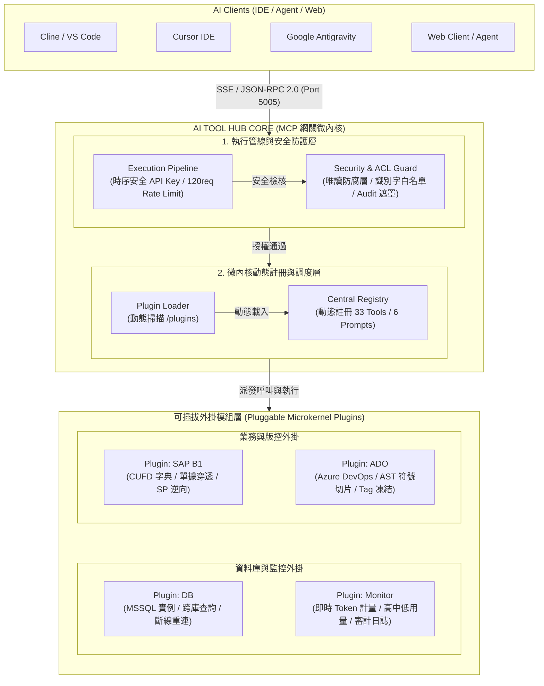

# SAP Business One Enterprise AI Gateway (MCP Server)

專為 SAP Business One (B1) 顧問與大型企業架構團隊設計的 **Enterprise Model Context Protocol (MCP) 網關中台**。本專案整合微內核動態外掛引擎 (Microkernel Plugin Engine)、零信任唯讀資料防腐層 (Zero-Trust ACL Guardrails)、長駐 SSE/HTTP 遠端傳輸與 AST 語意符號抽取，將 MS SQL Server 2012~2022 與 Azure DevOps 需求/版控系統無縫抽象為統一的 AI 驅動服務。

---

## 核心架構全景：可插拔 AI Tool Hub



---

## 專案目錄結構 (Project Directory Structure)

```
SapB1McpServer/
├── .agent/                      # AI Agent 規範、提示詞與自訂 Skills
│   ├── commands/                # 常用業務反向工程、分析與發布指令樣板
│   ├── references/              # SAP SDK 與開發規範參考文件
│   ├── skills/                  # 客製化 Agent 技能模組 (grill-me, caveman 等)
│   └── AGENTS.md                # 架構與開發守則規範
├── config/                      # 連線與伺服器設定目錄 (具備 .example 範本)
│   ├── devops.example.json      # Azure DevOps PAT 與組織設定範本
│   ├── environments.json        # 7 大 VM 實例與資料庫連線池設定
│   ├── plugins.json             # 微內核外掛啟用開關設定
│   └── server.json              # SSE 伺服器埠號、API Key 與 IP 白名單
├── docs/                        # 系統架構與技術治理規範
│   └── ARCHITECTURE.md          # TOGAF 分層架構模型與資安治理規格書
├── logs/                        # 審計日誌目錄 (自動生成，每日滾動留存 180 天)
├── plugins/                     # 動態可插拔外掛模組目錄 (Microkernel Plugins)
│   ├── azure-devops/            # Azure DevOps 版控與需求管理外掛
│   │   ├── index.js             # 外掛進入點與工具註冊
│   │   └── manifest.json        # 外掛描述檔 (名稱、版本、依賴)
│   └── sap-b1-sql/              # SAP B1 / MS SQL 核心查詢外掛
│       ├── index.js             # 外掛進入點與工具註冊
│       └── manifest.json        # 外掛描述檔
├── scripts/                     # 自動化建置與商業發布工具
│   └── build-obfuscate.js       # 程式碼深度混淆與發布包封裝 (npm run build)
├── src/                         # MCP 網關核心原始碼
│   ├── audit.js                 # 審計日誌 (Audit Trail) 與 Token 消耗稽核
│   ├── config.js                # 多環境與全域設定載入器
│   ├── constants.js             # SAP 單據表映射與查詢上限常數
│   ├── db.js                    # 多連線池快取與斷線自動重連 (Auto-Reconnect)
│   ├── devops/                  # Azure DevOps REST API 與 AST 語意符號切片
│   │   ├── azureDevops.js       # Azure Git / Work Item / PR / Tag API 封裝
│   │   └── symbolParser.js      # C# / SQL AST 符號抽取引擎
│   ├── guardrails.js            # 零信任唯讀防腐層與識別字元白名單校驗
│   ├── hub.js                   # PluginHub 微內核核心註冊與執行派發引擎
│   ├── index.js                 # MCP Server 主進入點 (支援 Stdio 模式)
│   ├── tokenMeter.js            # 即時 Token 計量器、高中低分級與用量監控儲存庫
│   ├── plugins/                 # 外掛載入器
│   │   └── loader.js            # 動態掃描 /plugins 並加載外掛
│   ├── prompts/                 # 6 大 SOP 業務稽核與逆向分析樣板
│   │   └── index.js             # Prompts 定義與執行處理器
│   ├── server.js                # Express 雙模態 SSE/HTTP 遠端伺服器 (Port 5005)
│   └── tools/                   # 33 大 Tools 工具定義與路由分派
│       └── index.js             # Tools 彙整與執行處理器
├── check-status.bat             # Windows 服務運行狀態即時檢測腳本 (零括號架構)
├── setup.bat                    # Windows 依賴安裝與環境一鍵配置腳本
├── start-background.bat         # Windows 無黑窗背景常駐啟動腳本 (VBScript 守護)
├── start-server.bat             # Windows 前台直接測試啟動腳本 (免 PM2，零括號防閃退)
├── stop-server.bat              # Windows 服務安全停止腳本
├── ecosystem.config.cjs         # PM2 常駐守護進程設定 (選用)
├── package.json                 # 專案相依套件與 NPM Scripts
└── README.md                    # 專案完整說明、API 字典與部署手冊
```

---

## 系統核心亮點與能力矩陣

- **即時 Token 計量與用量監控 (Real-Time Token Meter & Monitor)**：
  - **毫秒級輕量啟發式計算**：精準衡量中英文、JSON 鍵值與 SQL 語法 Token，零外部相依。
  - **高中低分級視覺化**：自動於每筆查詢尾綴標記 🟢低 (`<1,000`) / 🟡中 (`1,000~4,000`) / 🔴高 (`>4,000`)。
  - **專屬監控工具**：內建 `sap_b1_get_token_usage_stats` 即時查看各工具消耗排行、環境分佈與高用量 TOP 查詢。
- **雙模運作架構 (Dual Transport Mode)**：
  - **Stdio 模式**：供本機 IDE (Cline, Cursor, Antigravity) 透過 Child Process 直接呼叫。
  - **HTTP/SSE 遠端模式 (Port 5005)**：Windows VM 背景常駐，支援標準 Server-Sent Events 與 Streamable JSON-RPC 雙向協定。
- **Windows 100% 線性零括號維運批次檔**：全腳本重構消除命令提示字元括號解析陷阱，杜絕閃退。
- **斷線自動重連 (Auto-Reconnect & Pool Cache)**：SQL Server 遇到逾時或重啟時自動建立新連線池，業務查詢零中斷。
- **企業級 API Key 認證 (`X-MCP-API-KEY`)**：配置時序安全金鑰比對與 IP 白名單過濾。
- **微內核動態外掛架構 (`/plugins`)**：支援動態熱載入，33 大工具與 6 大 SOP Prompts 模組化隔離。
- **公文式切鍋與防身自保 (CYA Protocol)**：自動比對 C# 程式碼與 DB CUFD 產生三方差異矩陣與簽核公文草稿。
- **TOGAF 分層架構文件**：提供完整的架構圖與技術規格指南 (`docs/ARCHITECTURE.md`)。

---

## 快速建置與部署

### 1. 安裝相依套件與設定檔初始化
```bash
npm install
cp config/environments.example.json config/environments.json
cp config/devops.example.json config/devops.json
cp config/server.example.json config/server.json
cp config/plugins.example.json config/plugins.json
```

### 2. 本機 Stdio 模式啟動 (預設)
```bash
node src/index.js
```

### 3. Windows Server / VM 實體機器常駐部署 (SSE Mode, Port 5005)

#### 首次部署與環境配置
1. **VM 環境準備**：確認 Windows VM 已安裝 **Node.js 18+ (LTS)** 與 **Git**。
2. **複製專案**：在 Windows VM 透過 Git clone 或解壓縮專案。
3. **設定連線檔**：編輯 `config/environments.json` (SQL 連線帳密) 與 `config/devops.json` (Azure PAT)。
4. **一鍵安裝並註冊開機自啟**：以**系統管理員身分**執行：
```cmd
setup-service.bat
```
腳本將自動完成 `npm install`、Windows Defender 防火牆開放 Port 5005、舊服務清理，並透過 PM2 啟動服務與註冊開機自啟。

5. **驗證健康狀態**：在瀏覽器開啟 `http://localhost:5005/health`，若顯示 `{"status":"ok", "toolsCount": 31}` 即部署成功。

#### 日後版本更新 (無中斷熱重載)
當 Git 有新版本時，在 Windows VM 執行：
```cmd
update-service.bat
```
自動執行 `git pull` $\rightarrow$ `npm install` $\rightarrow$ `pm2 reload` 完成零中斷更新。

#### 常用維運管理指令
```cmd
pm2 status                        # 檢查服務運行狀態
pm2 logs sap-b1-mcp-gateway       # 檢視即時運行與審計日誌
pm2 restart sap-b1-mcp-gateway    # 快速重啟服務
uninstall-service.bat             # 完整卸載開機自啟服務
```

---

### 4. 商業交付與程式碼混淆封裝 (Code Obfuscation & Delivery)

針對將本網關以封閉商業軟體交付客戶 VM 的情境，專案內建 AST 與 Control Flow 深度混淆引擎：

```bash
npm run build
```

* **產出目錄**：自動編譯原始碼並輸出至 `dist/`。
* **保護機制**：
  - 控制流平坦化 (Control Flow Flattening) 與無用程式碼注入 (Dead Code Injection)。
  - 字串陣列 RC4/Base64 動態加密與抽取 (String Array Encoding)。
  - 識別字元十六進位混淆與語意抹除。
  - 自動封裝正式發布之 `package.json` 與所有 Windows 維運批次檔。
* **交付方式**：直接將 `dist/` 目錄壓縮為 ZIP 交付至客戶端 VM，解壓縮後直接執行 `setup-service.bat` 即可運作，完全隱藏商業原始碼。

---

## 伺服器與資安防護配置 (config/server.json)

伺服器網路、安全認證與防腐設定儲存於 `config/server.json`：

```json
{
  "port": 5005,
  "apiKey": "b1-mcp-secret-key-2026",
  "enableSse": true,
  "allowedOrigins": ["*"],
  "allowedIps": ["127.0.0.1", "::1", "192.168.170.*", "10.*"],
  "rateLimitWindowMs": 60000,
  "rateLimitMax": 120,
  "toolTimeoutMs": 30000
}
```

* **`port`**：SSE 伺服器監聽之連接埠（預設 5005）。
* **`apiKey`**：伺服器驗證金鑰（具備時序安全比對）。所有連線請求必須在 Header 包含 `x-mcp-api-key: <apiKey>`，否則一律回傳 `401 Unauthorized` 阻斷連線。
* **`allowedIps`**：來源 IP 存取白名單。支援精確 IP、萬用字元（如 `192.168.170.*`）與 IPv6 映射，非名單 IP 阻斷並回傳 `403 Forbidden`。
* **`rateLimitWindowMs` / `rateLimitMax`**：滑動窗口 Rate Limiter 防爆機制。預設每分鐘單一 IP 上限 120 次請求，超標回傳 `429 Too Many Requests`。
* **`toolTimeoutMs`**：單一工具執行熔斷超時時間（預設 30000ms）。
* **審計日誌 (Audit Trail)**：所有存取事件、工具呼叫、參數（自動遮罩）與執行時間自動記錄於 `logs/audit-YYYY-MM-DD.log`（保留 180 天，合規資通系統防護基準）。

---

## MCP 客戶端配置

### 模式 A：本機 Stdio 模式 (Local Process)
在客戶端設定檔（如 `mcp_config.json` 或 `cline_mcp_settings.json`）設定：
```json
{
  "mcpServers": {
    "sap-b1-sql": {
      "command": "node",
      "args": [
        "<專案絕對路徑>/src/index.js"
      ]
    }
  }
}
```

### 模式 B：遠端 SSE 模式 (Remote Windows VM)
Mac 開發機直接連線至遠端 Windows 開發機（例如 `192.168.170.233:5005`），請於 `headers` 帶入與 `config/server.json` 相同的 `x-mcp-api-key`：
```json
{
  "mcpServers": {
    "sap-b1-remote-gateway": {
      "url": "http://<Server IP 路徑>:5005/sse",
      "headers": {
        "x-mcp-api-key": "b1-mcp-secret-key-2026"
      }
    }
  }
}
```

---

## 多環境與開發機配置 (config/environments.json)

支援 7 台開發機 VM 與帳套資料庫動態切換：

| 環境代碼 (`envKey`) | 伺服器 IP | 預設資料庫 | 涵蓋專案 / 客戶標籤 |
| :--- | :--- | :--- | :--- |
| `VM_212` | `192.168.170.212` | `master` | 中外、佳和、普德、鉅晶、霖宏 |
| `VM_213` (或 `SBM_DEV`) | `192.168.170.213` | `SBM_Qas` | 中外、析數、高更、新武、銘享 |
| `VM_216` (或 `LES_DEV`) | `192.168.170.216` | `LES_QAS` | 三千、郭元益、新武、麗嬰房 |
| `VM_223` (或 `KYY_FOOD_DEV`) | `192.168.170.223` | `KYY_FOOD_PRD` | 郭元益 |
| `VM_224` | `192.168.170.224` | `master` | 迷客夏 |
| `VM_229` | `192.168.170.229` | `master` | 安得利 |
| `VM_233` (或 `tcmc_DEV`) | `192.168.170.233` | `tcmc_test` | tcmc 台灣細胞 (帳套、中介庫與日誌庫) |

---

## 工具集清單 (33 大 Tools Reference)

### 1. SQL Server、SAP B1 資料庫與 Token 監控工具 (15 項)

| 工具代碼 | 說明 | 參數定義 | 自然語言提問範例 |
| :--- | :--- | :--- | :--- |
| `sap_b1_get_token_usage_stats` | **【Token 用量監控儀表】**：查詢當前 Session 累計 Token 消耗、各工具用量佔比與 TOP 10 查詢排行 | `reset` (bool, 選填) | 「查看目前 Token 消耗統計與用量排行」 |
| `sap_b1_list_environments` | 環境清單：列出所有已註冊之資料庫連線與目前作用中環境 | 無 | 「列出目前所有已配置的連線環境」 |
| `sap_b1_set_active_env` | 環境切換：動態切換作用中連線環境 | `env` (string, 必填) | 「把連線環境切換到 `VM_216`」 |
| `sap_b1_list_databases` | 資料庫探索與指紋辨識：掃描主機上的所有 DB，自動分類為 SAP 帳套庫或第三方/中介庫 | `env` (string, 選填) | 「列出 216 這台上的所有資料庫，並區分帳套與中介庫」 |
| `sap_b1_get_document` | 單據快速提取：擷取指定單據之表頭 (Header)、明細列 (Lines) 與自訂欄位 (UDF) | `docType`, `docNum`, `byDocEntry` | 「抓取採購單 2024001 的完整單據內容」 |
| `sap_b1_get_doc_flow` | 單據生命週期追蹤：依據 BaseEntry 向上向下遞迴追蹤單據關聯 | `docType`, `docNum`, `byDocEntry` | 「追蹤訂單 10502 的後續出貨與發票流程」 |
| `sap_b1_query_sql` | 唯讀 SQL 查詢：具備語法防禦、NOLOCK 強制注入、500 筆上限保護與三段式跨庫查詢 | `sql`, `env`, `database` | 「查詢 `LES_QAS.dbo.OPOR` 最近 10 筆採購單」 |
| `sap_b1_validate_sql` | 語法驗證：使用 SET NOEXEC ON 進行資料庫語法乾跑檢驗 | `sql` | 「驗證這段多表關聯 SQL 是否有語法錯誤」 |
| `sap_b1_get_table_schema` | 表結構檢索：支援三段式名稱 (`[db].[dbo].[table]`)，查詢欄位型態與長度 | `tableName`, `database` | 「查 `ORDR` 表的欄位型別與長度」 |
| `sap_b1_get_udf` | 自訂欄位分析：查詢 CUFD 自訂欄位定義與 UFD1 下拉選單有效值 | `tableId`, `database` | 「查 `ORDR` 表上的所有 UDF 自訂欄位與下拉選單值」 |
| `sap_b1_get_udf_dictionary` | **【SA 專用業務字典】**：產出指定表單 UDF 的中英文描述、型別與有效值清單 | `tableId`, `database` | 「產出 `ORDR` 表單的完整 UDF 業務欄位字典」 |
| `sap_b1_get_sp_definition` | 預存程序原始碼：讀取 sys.sql_modules 中之預存程序完整 SQL 定義 | `spName`, `database` | 「讀取 `SBO_SP_TransactionNotification` 的完整原始碼」 |
| `sap_b1_get_sp_parameters` | 預存程序參數：查詢預存程序之輸入/輸出參數清單與型態 | `spName`, `database` | 「查預存程序 `LES_SP_CheckApprovalPO` 的參數清單」 |
| `sap_b1_trace_sp_dependencies` | **【SP 依賴呼叫鏈】**：分析 SP 呼叫之子 SP、參照之資料表 (Tables) 與視圖 (Views) | `spName`, `database` | 「分析 `SBO_SP_TransactionNotification` 參照了哪些資料表與子 SP」 |
| `sap_b1_search_sql_modules` | **【DB 物件全文檢索】**：全文檢索所有 SP、View、Trigger、Function 原始碼中之欄位或邏輯 | `query`, `typeDesc`, `database` | 「在 DB 全文搜尋是否有預存程序參照 `YPICKLIST_MAF`」 |

---

### 2. Azure DevOps 版控與需求管理工具 (18 項)

| 工具代碼 | 說明 | 參數定義 | 自然語言提問範例 |
| :--- | :--- | :--- | :--- |
| `azure_devops_get_config` | 檢視連線配置：檢查當前組織、預設專案與 Token 遮罩狀態 | 無 | 「檢查目前 Azure DevOps 連線狀態」 |
| `azure_devops_set_config` | 動態更新配置：即時更新 PAT Token、組織名稱或預設專案 | `pat`, `organization`, `defaultProject` | 「把預設專案改為 `LES`」 |
| `azure_devops_list_projects` | 專案清單：列出帳號具備權限之所有 70+ 個 Azure DevOps Projects | 無 | 「列出 Azure DevOps 上我能存取的所有專案」 |
| `azure_devops_list_repos` | 儲存庫清單：列出指定專案下的所有 Git Repositories | `project` | 「列出專案 `LES` 下的所有 Repos」 |
| `azure_devops_list_files` | 目錄瀏覽：檢視指定儲存庫路徑下的檔案與資料夾清單 | `repo`, `project`, `path`, `branch` | 「列出 `LESB1Solution` 儲存庫中的目錄結構」 |
| `azure_devops_get_file` | 檔案讀取：讀取特定檔案內容 (C#, SQL, XML, JS 等，自動解碼) | `repo`, `filePath`, `project`, `branch` | 「抓取 `LESB1Solution` 中的 `/exec/sql/sp.sql` 檔案內容」 |
| `azure_devops_get_symbols` | **【AST 符號概覽】**：解析 C# 或 SQL 檔案中的所有類別、方法、SP 清單與行號 | `repo`, `filePath`, `project` | 「分析 `sp.sql` 裡面定義了哪些預存程序與行數範圍」 |
| `azure_devops_get_symbol_content` | **【精準方法擷取】**：僅擷取特定類別、方法或 SP 程式碼區塊（含註解），節省 Token | `repo`, `filePath`, `symbolName` | 「抓取 `sp.sql` 裡的 `LES_SP_CheckApprovalPO` 完整邏輯」 |
| `azure_devops_diff_files` | **【跨專案語意比對】**：比對兩專案/儲存庫檔案的語意符號差異 (新增/刪除的方法或 SP) | `sourceProject`, `sourceRepo`, `targetProject`... | 「比對 `SMB.KYY` 與 `LES` 的 Addon 主程式差異」 |
| `azure_devops_get_work_item` | **【Work Item 詳情】**：讀取需求、Bug、Task 的詳細描述、Acceptance Criteria 與負責人 | `id`, `project` | 「查 Work Item `#20876` 的 Bug 描述與目前狀態」 |
| `azure_devops_search_work_items` | **【Work Item 搜尋】**：依關鍵字或狀態檢索指定專案下的需求卡片 | `query`, `project`, `state`, `top` | 「搜尋 `SMB.KYY` 專案中狀態為 Active 的 Bugs」 |
| `azure_devops_list_pull_requests` | PR 清單：查詢指定儲存庫的 Pull Requests | `repo`, `project`, `status` | 「列出 `KYY_Addon_Picking` 目前開啟中的 PR」 |
| `azure_devops_create_branch` | **【防禦性開分支】**：強制命名規範 (`ai-patch/*`, `fix/*`, `feat/*`, `release/*`, `hotfix/*`, `freeze/*`) 建立分支 | `repo`, `newBranchName`, `sourceBranch` | 「從 main 分支建立 `release/v1.0.0-prd` 分支」 |
| `azure_devops_create_tag` | **【Git Tag 凍結版本】**：在指定儲存庫來源分支最新 Commit 上建立不可變 Tag 標籤 | `repo`, `tagName`, `sourceBranch` | 「在 main 分支建立 `v1.0.0-prd-20260918` Tag」 |
| `azure_devops_create_pull_request` | **【防禦性發起 PR】**：預設以 Draft 草稿形式發起 PR 供人工審查 | `repo`, `title`, `sourceBranch`... | 「針對 `ai-patch/fix-po-budget` 建立 Draft PR」 |
| `azure_devops_search_code` | 全域程式碼搜尋：在全組織或指定專案搜尋關鍵字、SP 或函式 | `query`, `project`, `top` | 「在 Azure DevOps 搜尋 `LES_SP_CheckApprovalPO`」 |
| `azure_devops_scan_impact` | **【跨儲存庫影響掃描】**：全域掃描關鍵字/UDF/SP 在所有 Repos 裡的引用與依賴分佈 | `query`, `project`, `top` | 「全域掃描 `YPICKLIST_MAF` 在所有 Addon Repos 的影響面」 |
| `azure_devops_list_commits` | 提交歷程：查詢指定儲存庫之最近 Git 提交歷史與作者 | `repo`, `project`, `top`, `branch` | 「查 `KYY_Addon_Picking` 最近 10 次的 Commit 紀錄」 |

---

## 預存業務分析與治理樣板 (6 大 Prompts Reference)

| 樣板名稱 | 業務範疇 | 核心檢核邏輯 | 觸發範例 |
| :--- | :--- | :--- | :--- |
| `audit_cr_compliance` | **CR 變更條款合規與迴歸稽核** | 條對條對比 CR 規格、程式碼與 DB Schema，產出合規矩陣、跨 Repo 影響分析與上線維運清單 | 「依據 CR 需求單全面稽核 `KYY_Addon_Picking` 的合規性與 DB 影響」 |
| `audit_csharp_to_db_mapping` | **公文切鍋與差異矩陣** | 自動比對 C# 專案程式碼與 SAP B1 資料庫 UDF/Schema，產出三方欄位差異矩陣與公文信件範本 | 「比對採購模組 C# 程式碼與 `OPOR` 資料表欄位差異並產出切鍋公文」 |
| `cross_db_sync_troubleshooter` | 跨庫單據同步排查 | 診斷第三方系統 (POS/MES/官網/EDI/中介庫) 與 SAP B1 之間的單據拋轉異常與主檔缺漏 | 「排查中介庫 `tcmcMiddleDb_QAS.OrderQueue` 與 SAP `tcmc_test` 的同步異常」 |
| `audit_customer_credit` | 客戶信用與財務風控 | 計算本幣信用額度使用率、逾期未沖銷發票 (OINV) 與折讓單 (ORIN) 沖銷評估 | 「審查客戶 `C20001` 的信用額度與逾期發票」 |
| `analyze_slow_moving_stock` | 倉庫呆滯料分析 | 聚焦銷貨物料 (SellItem = 'Y')，交叉比對銷貨發票、出貨單與工單發料動態，篩選超期無動態庫存 | 「分析倉庫 `PB` 超過 180 天無動態的呆滯料」 |
| `reverse_engineer_sp` | 預存程序逆向工程 | 剖析 SBO_SP_TransactionNotification 等 SP 防呆規則，整理業務約束條件表與流程圖 | 「逆向剖析 `SBO_SP_TransactionNotification` 的防呆邏輯」 |

---

## 即時 Token 計量與用量監控系統 (Token Meter)

本系統內建輕量化、純 CPU 啟發式 Token 估算器，無額外依賴套件，毫秒級產出結果並自動記錄審計日誌。

### 1. 三級用量分級與視覺化標籤
- 🟢 **低 (Low)**：`< 1,000 Tokens`（一般單據單筆、表結構）
- 🟡 **中 (Medium)**：`1,000 ~ 4,000 Tokens`（一般單據明細、UDF 字典）
- 🔴 **高 (High / Alert)**：`> 4,000 Tokens`（大型預存程序、大量資料集查詢）

**回傳指標範例**：
```text
[執行資訊: 耗時 25ms | 筆數 15 | Token: ~850 (🟢低) | 環境: VM_233 (192.168.170.233 / tcmc_test)]
```

### 2. 監控工具：`sap_b1_get_token_usage_stats`
隨時取得當前 Session 的結構化用量監控儀表：
- **`overview`**：總呼叫次數、總消耗 Token、平均每筆 Token、高/中/低分佈。
- **`byToolUsage`**：各工具呼叫次數、總消耗量、平均消耗與百分比排行。
- **`topHeavyQueries`**：最近前 10 筆高 Token 消耗查詢，快速鎖定引發 Context 暴增的 SQL/SP。
- **重置**：可傳入 `{"reset": true}` 清空當前 Session 統計指標。

### 3. 維運與審計整合
- **`logs/audit-YYYY-MM-DD.log`**：每筆日誌自動包含 `estimatedTokens` 與 `tokenLevel`。
- **`GET /health` 端點**：即時暴露 `tokenMetrics` 概要數據供維運監控系統撈取。

---

## 架構文件參考

詳細 TOGAF 分層架構模型、安全防禦防腐層實作規範，請參閱：
[ARCHITECTURE.md](ARCHITECTURE.md)
